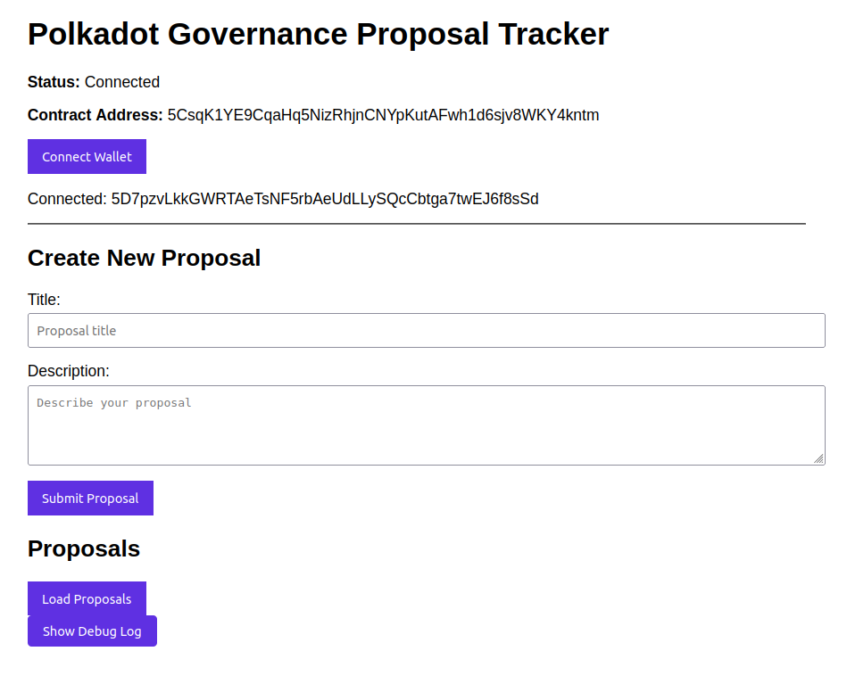
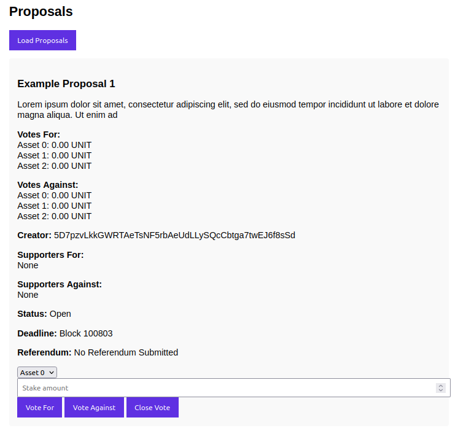
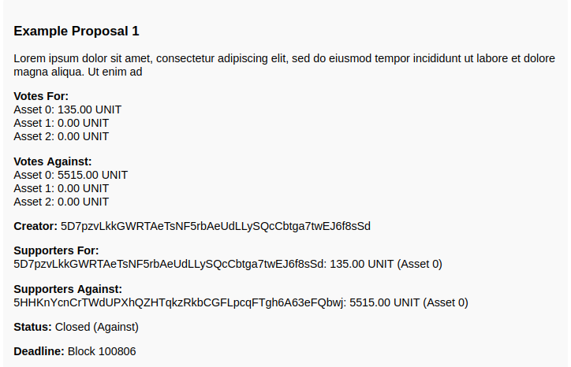

# Polkadot Governance Tracker

This repository contains a submission for the **2025 Polkadot Scalability Hackathon** under the **Polkadot and Smart Contracts sub-track**. The Polkadot Governance Tracker is a decentralized governance smart contract built with **ink! 4.3** for the Polkadot ecosystem. It enables users to submit proposals, vote using multiple assets (including the native UNIT token), simulate integration with the Polkadot Democracy pallet, and emit cross-chain events for interoperability. A Vite-based JavaScript frontend (`main.js`) provides a user-friendly interface to interact with the contract, deployed on a local `substrate-contracts-node` development testnet.

## Table of Contents
- [Overview](#overview)
- [Features](#features)
- [Demo](#demo)
- [Prerequisites](#prerequisites)
- [Environment Setup](#environment-setup)
- [Project Setup](#project-setup)
- [Usage](#usage)
- [Testing](#testing)
- [Deployment](#deployment)
- [Screenshots](#screenshots)
- [Troubleshooting](#troubleshooting)
- [Hackathon Submission Details](#hackathon-submission-details)
- [Limitations](#limitations)
- [Future Improvements](#future-improvements)
- [License](#license)
- [Contact](#contact)

## Overview
The Polkadot Governance Tracker is a proof-of-concept smart contract showcasing Polkadot’s capabilities in decentralized governance, multi-asset systems, and cross-chain interoperability. Built using **ink! 4.3**, the contract allows users to:
- **Submit Proposals**: Create governance proposals with a title, description, and a minimum deposit of 1 UNIT (10^12 Planck).
- **Vote with Multiple Assets**: Support voting with the native UNIT token (`asset_id: 0`) and placeholder assets (`asset_id: 1, 2`), demonstrating Polkadot’s multi-asset potential.
- **Simulate Democracy Pallet Integration**: Assign a `referendum_index` to proposals that pass, mimicking submission to the Polkadot Democracy pallet.
- **Emit Cross-Chain Events**: Broadcast `CrossChainMessage` events to other parachains (e.g., `target_chain: 1000`) for proposal creation and referendum submission.
- **Interact via Frontend**: A web-based UI (`main.js`, served at `http://localhost:8080`) enables users to manage proposals, vote, and view referendum status.

The contract is deployed on a local `substrate-contracts-node` testnet, leveraging Polkadot’s **RISC-V-compatible Virtual Machine (PVM)**. The project addresses the hackathon’s goals by integrating governance, multi-asset voting, and cross-chain awareness, with a user-friendly frontend to enhance accessibility.

## Features
| Feature | Description |
|---------|-------------|
| **Proposal Management** | Users can submit, vote on, close, or cancel governance proposals. Proposals require a minimum deposit of 1 UNIT. |
| **Multi-Asset Voting** | Supports voting with multiple assets: native UNIT (`asset_id: 0`) and placeholder assets (`asset_id: 1, 2`). Votes are tracked per asset and voter. |
| **Democracy Pallet Simulation** | Proposals that pass (more votes in favor) are assigned a `referendum_index`, simulating submission to the Democracy pallet. |
| **Cross-Chain Awareness** | Emits `CrossChainMessage` events to notify parachains (e.g., `target_chain: 1000`) about proposal creation and referendum submission. |
| **Frontend Interface** | A Vite-based UI displays proposal details, vote totals (e.g., `Asset 0: 1.00 UNIT`), and referendum status. Users can interact via the Polkadot{.js} extension. |
| **RISC-V Compatibility** | Built with ink! 4.3, ensuring compatibility with Polkadot’s PVM for scalable execution. |
| **Debug Logging** | The frontend includes a toggleable debug log to display transaction details, gas estimates, and errors for easier troubleshooting. |

## Demo
- **Demo Video**: [Watch the demo on YouTube](https://youtu.be/7j9jQTNGkIY)
- **Description**: The video demonstrates:
  - Connecting a wallet via Polkadot{.js} extension.
  - Funding wallets.
  - Submitting a proposal with a 1 UNIT deposit.
  - Voting for/against with asset 0.
  - Closing a proposal.

## Prerequisites
The project requires a **Linux environment** (tested on Ubuntu 20.04/22.04). Below are the dependencies and system requirements.

### Dependencies
| Dependency | Version | Purpose |
|------------|---------|---------|
| **Rust Toolchain** | `1.81.0` | Compiling the ink! contract |
| **cargo-contract** | `4.1.0` or later | Building and deploying the contract |
| **substrate-contracts-node** | `v0.42.0` | Local testnet for contract deployment |
| **Node.js** | `18.x` or later | Running the Vite-based frontend |
| **npm** | Included with Node.js | Managing frontend dependencies |
| **Nginx** | Latest | Serving the frontend on `http://localhost:8080` |
| **Netcat** | Latest | Checking node availability |
| **Polkadot{.js} Extension** | Latest | Wallet for contract interactions |

### Contract Dependencies (in `Cargo.toml`)
```toml
[dependencies]
ink = { version = "4.3", default-features = false }
parity-scale-codec = { version = "3", default-features = false, features = ["derive"] }
scale-info = { version = "2.9", default-features = false, features = ["derive"] }
```

### System Requirements
- **OS**: Linux (Ubuntu 20.04/22.04 recommended)
- **RAM**: Minimum 4GB
- **Disk Space**: 20GB free
- **Internet**: Required for dependency installation

## Environment Setup
Follow these steps to set up the environment on a Linux system (e.g., Ubuntu 22.04).

1. **Install System Dependencies**:
   ```bash
   sudo apt-get update
   sudo apt-get install -y build-essential curl wget git netcat-openbsd nginx
   ```

2. **Install Rust Toolchain**:
   ```bash
   curl --proto '=https' --tlsv1.2 -sSf https://sh.rustup.rs | sh
   source $HOME/.cargo/env
   rustup update
   rustup toolchain install nightly
   rustup target add wasm32-unknown-unknown --toolchain nightly
   ```

3. **Install `cargo-contract`**:
   ```bash
   cargo install cargo-contract --version 4.1.0 --force
   cargo contract --version
   ```

4. **Install `substrate-contracts-node`**:
   ```bash
   wget https://github.com/paritytech/substrate-contracts-node/releases/download/v0.42.0/substrate-contracts-node-linux.tar.gz
   tar -xzf substrate-contracts-node-linux-v0.42.0.tar.gz
   sudo mv substrate-contracts-node-linux/substrate-contracts-node /usr/local/bin/
   substrate-contracts-node --version
   ```
   

5. **Install Node.js and npm**:
   ```bash
   curl -fsSL https://deb.nodesource.com/setup_18.x | sudo -E bash -
   sudo apt-get install -y nodejs
   node --version
   npm --version
   ```

6. **Clone the Repository**:
   ```bash
   git clone https://github.com/Dcwind/polkadot-sc-up polkadot-governance-tracker
   cd polkadot-governance-tracker
   ```

7. **Verify Directory Structure**:
   Ensure the following files are present:
   ```bash
   ls -l
   # Minimum expected output:
   # Cargo.toml
   # frontend.sh
   # frontend/config/contract-address.js
   # frontend/main.js
   # index.html
   # lib.rs
   # start.sh
   ```

## Project Setup
Set up the contract and frontend using the provided scripts.

### 1. Build and Deploy the Contract
The `start.sh` script builds the contract, starts a local `substrate-contracts-node`, and deploys the contract.

1. **Make the Script Executable**:
   ```bash
   chmod +x start.sh
   dos2unix start.sh
   ```

2. **Run the Script**:
   ```bash
   ./start.sh
   ```
   **Actions Performed**:
   - Builds the contract: `cargo contract build --release`.
   - Starts `substrate-contracts-node` on `ws://localhost:9944`.
   - Deploys the contract with:
     - `min_deposit`: `1_000_000_000_000` Planck (1 UNIT).
     - `voting_period`: `100800` blocks (~7 days at 6s/block).
     - `supported_assets`: `[0, 1, 2]` (UNIT as `0`, placeholders `1`, `2`).
   - Saves the contract address to `frontend/config/contract-address.js`.
   - Copies metadata to `frontend/public/target/ink/governance_tracker.json`.
   **Output**:
   ```bash
   Contract deployed successfully at address: 5XXX...
   Copied metadata to frontend/public/target/ink/governance_tracker.json
   ```

3. **Keep the Terminal Open**:
   The node runs in the background. Open a new terminal for the next steps.

### 2. Build and Serve the Frontend
The `frontend.sh` script builds the frontend and serves it via Nginx on `http://localhost:8080`.

1. **Make the Script Executable**:
   ```bash
   chmod +x frontend.sh
   dos2unix frontend.sh
   ```

2. **Run the Script**:
   ```bash
   ./frontend.sh
   ```
   **Actions Performed**:
   - Verifies Node.js 18.x and Nginx.
   - Checks contract artifacts (`governance_tracker.json`, `contract-address.js`).
   - Installs frontend dependencies: `npm install`.
   - Builds the frontend: `npm run build`.
   - Copies the build to `/var/www/html`.
   - Configures Nginx to serve on port `8080`.
   - Restarts Nginx.
   **Output**:
   ```bash
   Nginx is serving on port 8080
   Open http://localhost:8080 in your browser.
   ```

3. **Access the Frontend**:
   - Open `http://localhost:8080` in a browser (e.g., Chrome).
   - Open Polkadot{.js} Apps at `https://polkadot.js.org/apps/?rpc=ws://localhost:9944#/accounts` to manage funds.

## Usage
Interact with the Governance Tracker via the frontend or Polkadot{.js} Apps.

### Frontend Interface
1. **Open the Frontend**:
   - Navigate to `http://localhost:8080`.

2. **Connect Wallet**:
   - Click “Connect Wallet” and select an account (e.g., `//Alice`) via Polkadot{.js} extension.

3. **Fund Wallet**:
   - If the wallet is empty:
     - Open Polkadot{.js} Apps (`https://polkadot.js.org/apps/?rpc=ws://localhost:9944#/accounts`).
     - Select a dev account (e.g., `//Bob`).
     - Click “Send” and enter the wallet’s address.
     - Send `10,000,000` UNIT.
     - Click “Make Transfer” and “Sign and Submit”.

4. **Test Features**:
   - **Submit Proposal**:
     - Enter a title (e.g., “Test Proposal”) and description (e.g., “A sample proposal”).
     - Click “Submit Proposal” (requires 1 UNIT deposit).
   - **Vote For/Against**:
     - Select an asset (`Asset 0` for UNIT. Assets `1`, or `2` are not implemented yet).
     - Enter a stake amount (≥1 UNIT).
     - Click “Vote For” or “Vote Against”.
     - Users can vote multiple times (even in both sides!) if the balance suffices.
   - **Close Vote**:
     - As the creator or owner, click “Close Vote” to tally votes.
     - If votes in favor exceed votes against, a `referendum_index` is assigned.
   - **View Details**:
     - View proposal status (`Open`, `Closed (In Favor)`, `Closed (Against)`, `Closed (Indecision)`).
     - Check vote totals (e.g., `Asset 0: 1.00 UNIT`) and referendum status.
   - **Debug Log**:
     - Click “Show Debug Log” to view transaction details, gas estimates, and errors.

5. **Test with Multiple Wallets**:
   - Create additional wallets in Polkadot{.js} Apps.
   - Fund them and vote to simulate multi-party governance.

## Testing
The contract and frontend have been tested locally on Ubuntu 22.04.

### Contract Tests

- **Manual Testing**:
  - Deploy the contract with `start.sh`.
  - Use Polkadot{.js} Apps to:
    - Submit proposals and verify `ProposalCreated` events.
    - Vote with different assets and check `Voted` events.
    - Close proposals and confirm `ProposalClosed` with `referendum_index`.

### Frontend Tests
- **Functional Testing**:
  - Connect wallet and verify account address display.
  - Submit a proposal and check the proposal list updates.
  - Vote for/against and confirm vote totals in the UI.
  - Close a proposal and verify the status changes to `Closed`.
- **Debug Logging**:
  - Enable debug log (`Show Debug Log`) to inspect:
    - Gas estimates (e.g., `refTime: 200_000_000_000` for `vote_for`).
    - Transaction status (`InBlock`, `Finalized`).
    - Errors (e.g., `ContractTrapped` for `getProposalCount`).

## Deployment
The contract is deployed locally using `substrate-contracts-node`.

1. **Local Deployment**:
   - Run `./start.sh` to:
     - Build the contract (`cargo contract build --release`).
     - Start the node (`substrate-contracts-node --dev`).
     - Deploy the contract with `cargo contract instantiate`.
   - Contract address is saved to `frontend/config/contract-address.js`.
   - Metadata is copied to `frontend/public/target/ink/governance_tracker.json`.

2. **Frontend Deployment**:
   - Run `./frontend.sh` to:
     - Build the frontend (`npm run build`).
     - Serve it via Nginx on `http://localhost:8080`.

3. **Production Considerations**:
   - For a live Polkadot parachain, update `start.sh` to use a public node URL (e.g., `wss://rpc.polkadot.io`).
   - Deploy the frontend to a cloud provider (e.g., AWS, Vercel) and update `main.js` to connect to the parachain’s RPC.

## Screenshots

1. **Frontend Home and Blank Proposal**:
   

2. **Proposal List and Voting Fields**:
   

3. **Completed Proposal**:
   


## Troubleshooting
| Issue | Solution |
|-------|----------|
| **Contract Build Fails** | Run `cargo clean` and `cargo contract build --release`. Ensure `rustc nightly` and `cargo-contract 4.1.0` are installed. |
| **Deployment Fails** | Check `start.sh` output. Verify `substrate-contracts-node` runs on `ws://localhost:9944`. Kill stale processes: `killall substrate-contracts-node`. |
| **Frontend Errors** | Run `frontend.sh` after `start.sh`. Check browser console for JavaScript errors. Ensure Polkadot{.js} extension is installed. |
| **Nginx Issues** | Check `/var/log/nginx/error.log`. Ensure port `8080` is free: `sudo netstat -tuln | grep 8080`. Restart Nginx: `sudo systemctl restart nginx`. |
| **ContractTrapped Error** | Redeploy with `start.sh` to ensure `governance_tracker.json` matches the contract. Verify `CONTRACT_ADDRESS` in `frontend/config/contract-address.js`. |

**Debugging Tips**:
- Enable debug log in the frontend (`Show Debug Log`).
- Check `start.sh` output for deployment errors.
- Use Polkadot{.js} Apps to manually call contract methods (e.g., `get_proposal_count`).
- Inspect node logs: `tail -f ~/.local/share/substrate-contracts-node/logs`.

## Hackathon Submission Details
This project aligns with the **Polkadot and Smart Contracts sub-track** of the 2025 Polkadot Scalability Hackathon.

### Source Code
- **Repository**: [https://github.com/Dcwind/polkadot-sc-up](https://github.com/Dcwind/polkadot-sc-up)
- **Key Files**:
  - Contract: `lib.rs`
  - Frontend: `frontend/main.js`, `index.html`
  - Scripts: `start.sh`, `frontend.sh`
  - Metadata: `frontend/public/target/ink/governance_tracker.json`
  - Config: `frontend/config/contract-address.js`

### AI Tools Used
| Tool | Purpose |
|------|---------|
| **Claude AI Sonnet 3.7** | Template generation for `lib.rs` and `main.js`. |
| **Grok 3** | Debugging contract errors, generating scripts (`start.sh`, `frontend.sh`), and optimizing README. |
| **ChatGPT-4-turbo** | Proofreading and optimizing frontend code and documentation. |

### References and Citations
- **ink! Documentation**:
  - [ink! Official Documentation](https://use.ink/) for contract development, storage, and events.
  - [ink! Examples](https://github.com/paritytech/ink-examples) for `Mapping` and event patterns.
- **Polkadot/Substrate Documentation**:
  - [Polkadot Wiki - Smart Contracts](https://wiki.polkadot.network/docs/learn-smart-contracts) for PVM and ink! basics.
  - [Substrate Contracts Node](https://github.com/paritytech/substrate-contracts-node) for local node setup.
  - [Polkadot.js API](https://polkadot.js.org/docs/api) for frontend integration with `@polkadot/api` and `@polkadot/extension-dapp`.
- **Multi-Asset and Governance**:
  - [Substrate Pallets](https://docs.substrate.io/reference/frame-pallets/) for multi-asset and governance concepts.

### Code Attribution
- **Contract (`lib.rs`)**: Built from scratch, inspired by ink! examples for storage mappings and events, but customized for governance and multi-asset voting. Assisted by Claude AI Sonnet 3.7.
- **Frontend (`main.js`, `index.html`)**: Uses `@polkadot/api` and `@polkadot/extension-dapp`, with logic adapted from Polkadot.js documentation examples. Assisted by Grok 3 and ChatGPT 4-Turbo.
- **Scripts (`start.sh`, `frontend.sh`)**: Generated with AI assistance (Grok 3) and tailored to the project’s requirements.
- No external code was directly reused.

### Developer Experience (DevEx) on Polkadot Smart Contracts
- **Strengths**:
  - **ink! Ergonomics**: The Rust-based DSL simplifies contract development with macros (`#[ink::contract]`) and abstractions like `Mapping` and events, making it approachable for Rust developers. Its verbosity seems to bring benefit in terms of code and logic correctness.
  - **Polkadot.js Ecosystem**: The `@polkadot/api` and `@polkadot/extension-dapp` libraries enabled seamless frontend integration, particularly for wallet connections and contract interactions.
  - **Local Development**: `substrate-contracts-node --dev` provided a fast, pre-funded environment (e.g., `//Alice`, `//Bob`) for testing, reducing setup friction.
  - **Community Resources**: The Polkadot Wiki and ink! documentation offered clear starting points for contract structure and deployment.
- **Middle Ground**:
  - **Debugging Tooling**: Error messages in `cargo-contract` are often clear and very structured (shown by the error codes), yet sometimes obscure. For example, an error like `Invalid metadata: expected type InkEvent, found Enum` during contract compilation was precise about the issue (mismatched event metadata) but lacked context on how to resolve it (e.g., checking `#[ink(event)]` annotations). This required cross-referencing forums and GitHub issues.
- **Challenges**:
  - **PAPI (polkadot-api) learning curve**: the project was supposed to use pure PAPI rather than the currently implemented server in Vite, due to the Polkadot API having many special concepts unfamiliar to non-Polkadot developers.
  - **Slow compilation time**: Compiling and building projects, as apparent in Rust development, are slower than Solidity.
  - **Chain Extension Limitations**: Simulating Democracy pallet integration was constrained without chain extensions, which are complex and underdocumented.
  - **Polkadot.{js}** browser extension shows no details about the wallet (multi-asset balance), list of transactions, etc.
  - **Access to Wallet Information**: the project was supposed to have a function that pulls information about a wallet (balance, transactions), but it was rather difficult to find out how to perform such an action.
  - **Non-UNIX support**: developing on Windows-based machines require WSL integration due to some library prerequisites relying on UNIX-only commands. The discrepancy between Windows and WSL file systems sometimes broke development pipeline.
- **Overall**: ink! and Polkadot provide a powerful platform for smart contracts, but the DevEx would benefit from more beginner-friendly tools and documentation to broaden adoption.

### Suggestions for Polkadot Tooling and Documentation
- **Tooling Improvements**:
  - **Clearer Error Messages**: Enhance `cargo-contract` to provide descriptive errors (e.g., for encoding issues like `UInt cannot be encoded as an array`) with suggested fixes. It is also beneficial to develop a `cargo-contract` debug mode to trace contract execution and storage changes.
  - **Gas Estimation Tool**: Add a `cargo-contract` feature to estimate gas limits for deployment and calls, minimizing manual tuning.
  - **Frontend Templates**: Offer official Vite/React templates for Polkadot.js-based frontends to simplify UI development.
  - **Polkadot.{js} Extension**: provide users with more detailed information regarding accounts, for example, multi-asset wallet balance, list of transactions, and more seamless integration with dApps. Compare Metamask.
- **Documentation Enhancements**:
  - **Comprehensive Tutorials**: Create end-to-end guides covering prerequisite installation both in UNIX-based system and Windows (Docker, etc.), contract development, frontend integration, and local testing in a single workflow. A guide to integrate PAPI with frontend would also help onboarding newcomers to implementing PAPI in projects that require backend and frontend.
  - **Chain Extension Examples**: Provide detailed tutorials on building chain extensions for pallets like `pallet_democracy` and `pallet-assets`.
  - **Error Troubleshooting**: Add a dedicated section in the ink! docs for common errors (e.g., Rust ownership, metadata issues).
  - **Multi-Asset Integration**: Include ink! examples for interacting with `pallet-assets` to support real tokens beyond UNIT.

### Bounty Alignment
The project meets the Polkadot and Smart Contracts sub-track requirements:
- **Multi-Asset Voting**:
  - Implemented in `vote_for` and `vote_against` (`lib.rs`, lines 183–257).
  - Supports `asset_id: 0` (UNIT) and placeholders `1`, `2`.
  - Frontend displays votes per asset (e.g., `Asset 0: 1.00 UNIT`).
- **Democracy Pallet Integration**:
  - Simulated in `close_vote` (`lib.rs`, lines 260–294).
  - Assigns `referendum_index` for passing proposals.
  - Emits `ProposalClosed` event with `referendum_index` (`lib.rs`, lines 64–68).
- **Cross-Chain Awareness**:
  - Emits `CrossChainMessage` events (`lib.rs`, lines 78–83) in `submit_proposal` (lines 175–179) and `close_vote` (lines 289–294).
  - Targets `target_chain: 1000` for proposal and referendum notifications.
- **RISC-V Compatibility**:
  - Built with ink! 4.3 for Polkadot’s PVM.

## Limitations
- **Democracy Pallet Simulation**: Lacks actual chain extension to call `pallet_democracy::propose`.
- **Placeholder Assets**: Assets `1` and `2` are not real tokens (no `pallet-assets` integration).
- **Cross-Chain Events**: `CrossChainMessage` events are emitted but not dispatched via XCM.
- **Frontend UX**: Limited error handling and no event listeners for real-time updates.
- **Non-Refundable Stakes**: Voting stakes are not refunded, unlike a balanced staking system.

## Future Improvements
- **Full Democracy Pallet Integration**: Add a chain extension to call `pallet_democracy::propose`.
- **XCM Integration**: Dispatch `CrossChainMessage` events via XCM for real cross-chain communication.
- **Real Assets**: Integrate `pallet-assets` for voting with non-native tokens.
- **Refundable Staking**: Implement a refundable staking system for votes.
- **Enhanced Frontend**: Add real-time event listeners, improve error handling, and enhance UI/UX.
- **Windows Support**: Provide Docker-based setup for Windows developers.

## License
MIT License. See `LICENSE` for details.

## Contact
For questions or contributions, contact **Damian Satya** at [umumlar5@gmail.com].